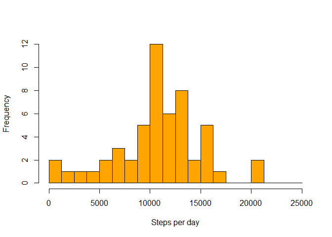
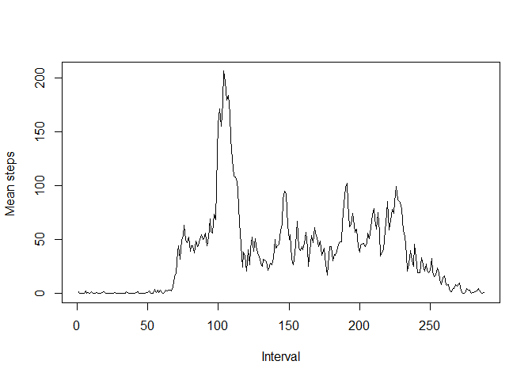
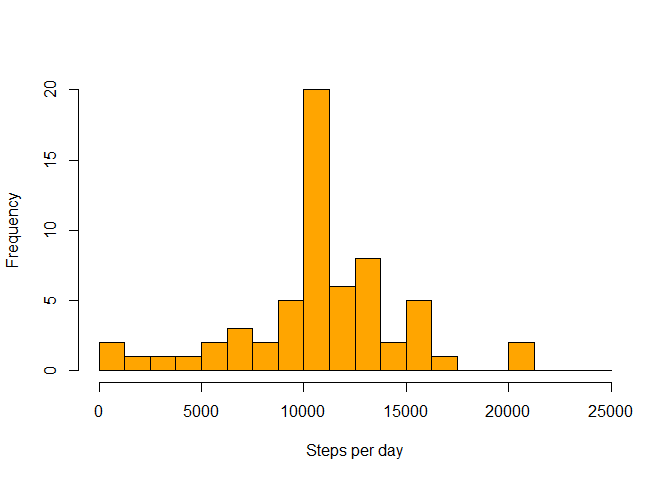
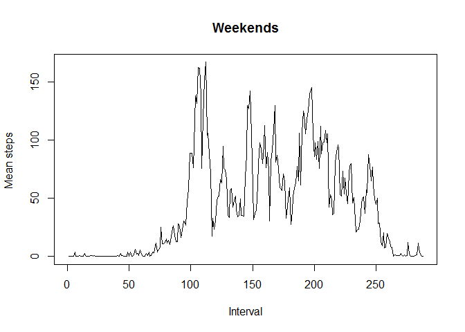
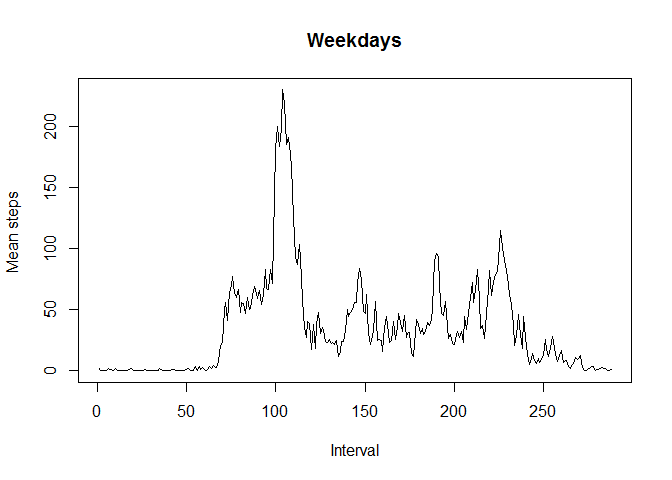

# REPRODUCIBLE RESEARCH: Assignment 1
###LOADING THE DATA

I downloaded the data and loaded them using the R Studio. After that I checked the format of the data and summarized them. 

```r
activity <- read.csv("~/R/Repreducible research/repdata-data-activity/activity.csv")
head(activity)
```

```
##   steps       date interval
## 1    NA 2012-10-01        0
## 2    NA 2012-10-01        5
## 3    NA 2012-10-01       10
## 4    NA 2012-10-01       15
## 5    NA 2012-10-01       20
## 6    NA 2012-10-01       25
```

```r
summary(activity)
```

```
##      steps               date          interval   
##  Min.   :  0.0   2012-10-01:  288   Min.   :   0  
##  1st Qu.:  0.0   2012-10-02:  288   1st Qu.: 589  
##  Median :  0.0   2012-10-03:  288   Median :1178  
##  Mean   : 37.4   2012-10-04:  288   Mean   :1178  
##  3rd Qu.: 12.0   2012-10-05:  288   3rd Qu.:1766  
##  Max.   :806.0   2012-10-06:  288   Max.   :2355  
##  NA's   :2304    (Other)   :15840
```


###MEAN AND MEDIAN TOTAL NUMBER OF STEPS TAKEN PER DAY

Firstly, I created new dataset that contains only complete observations from the original one. Then I computed total number steps of each day using `tapply()` function. Finally, I computed the mean and the median total number of steps per day and plotted the histogram.

```r
dat1<-activity[complete.cases(activity),]
step.sum<-tapply(dat1$step,dat1$date,sum)
```

```
## Warning: Name partially matched in data frame
```

```r
mean(step.sum,na.rm=TRUE)
```

```
## [1] 10766
```

```r
median(step.sum,na.rm=TRUE)
```

```
## [1] 10765
```

```r
hist(step.sum,seq(0,25000,1250),col="orange",xlab="Steps per day",main="")
abline(v=mean(step.sum,na.rm=TRUE),col="red")
legend(20000,12,"Mean",lty=1,col="red")
```

 


The mean is 1.0766 &times; 10<sup>4</sup> and the median is 10765


###AVERAGE DAILY ACTIVITY PATTERN

I used the modified dataset from previous question. The function `tapply()` was used to compute the  average steps for each interval. Subsequently, I created time series plot showing the average steps by time interval. 

```r
int.mean<-tapply(dat1$step,as.factor(dat1$interval),mean)
```

```
## Warning: Name partially matched in data frame
```

```r
library(nnet)
```

```
## Warning: package 'nnet' was built under R version 3.1.1
```

```r
int.mean[which.is.max(int.mean)]
```

```
##   835 
## 206.2
```

```r
plot(int.mean,type="l",ylab="Mean steps ",main="",xlab="Interval")
```

 


The highest average steps are 206.1698 in interval 835.


###MISSING VALUES

I decided to replace missing values by the average steps of interval. As the first step, I calculated the average steps for each interval. Then I converted the output to dataframe and merged it with the original dataframe. After that, I easilly replaced NA with matching interval average. In the end, I computed mean, median and plotted the histogram. 
 

```r
dat2<-activity
my.mean<-function(x) mean(x,na.rm=TRUE)
int.mean2<-tapply(activity$step,as.factor(activity$interval),my.mean)
```

```
## Warning: Name partially matched in data frame
```

```r
df.int.mean2<-data.frame(interval=names(int.mean2),mean=as.vector(int.mean2))
dat2<-merge(dat2,df.int.mean2,by="interval")
dat2$steps[is.na(dat2$steps)]<-dat2$mean[is.na(dat2$steps)]
step.sum3<-tapply(dat2$step,dat2$date,sum)
```

```
## Warning: Name partially matched in data frame
```

```r
mean(step.sum3,na.rm=TRUE)
```

```
## [1] 10766
```

```r
median(step.sum3,na.rm=TRUE)
```

```
## [1] 10766
```

```r
hist(step.sum3,seq(0,25000,1250),col="orange",xlab="Steps per day",main="")
abline(v=mean(step.sum3,na.rm=TRUE),col="red")
legend(20000,20,"Mean",lty=1,col="red")
```

 


In the original dataframe, there is 2304 NAs.
After replacing NA with interval averages I computed that the mean total number of steps is 1.0766 &times; 10<sup>4</sup> and the median total number of steps is 1.0766 &times; 10<sup>4</sup>. This values are different than values computed from data with ommited NAs. Replacing NAs by  interval means shifted the median towards the mean. As can be seen from histogram, data are now more concetrated around the mean.  


###DIFFERENCES IN ACTIVITY PATTERNS BETWEEN WEEKDAYS AND WEEKENDS

I used `strptime()` function to identify days. After that, I splitted the dataset to the  weekend and the weekday datasets. Finally, the interval means were computed and graph plotted for each dataset.


```r
Rdate2<-strptime(as.character(dat2$date),"%Y-%m-%d")
dat3<-cbind(dat2,wd=as.factor(Rdate2$wday))
levels(dat3$wd)<-c("weekend","weekday","weekday","weekday","weekday","weekday","weekend")
dat.weekend<-dat3[dat3$wd=="weekend",]
dat.weekday<-dat3[dat3$wd=="weekday",]
int.mean.weekend<-tapply(dat.weekend$step,as.factor(dat.weekend$interval),mean)
```

```
## Warning: Name partially matched in data frame
```

```r
int.mean.weekday<-tapply(dat.weekday$step,as.factor(dat.weekday$interval),mean)
```

```
## Warning: Name partially matched in data frame
```

```r
plot(int.mean.weekend,type="l",ylab="Mean steps ",main="Weekends",xlab="Interval")
```

 

```r
plot(int.mean.weekday,type="l",ylab="Mean steps ",main="Weekdays",xlab="Interval")
```

 

 
As can be seen, activity  patterns are different between weekdays and weekend. Activity pattern on weekend clearly shows more volatility.
